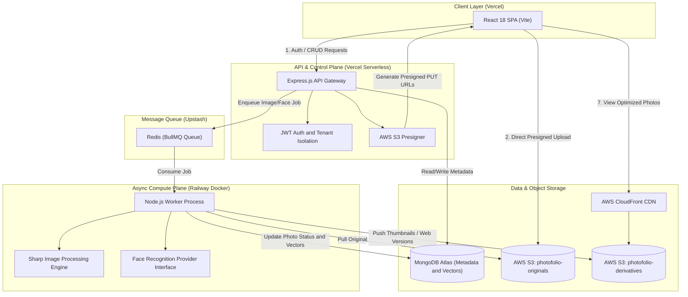
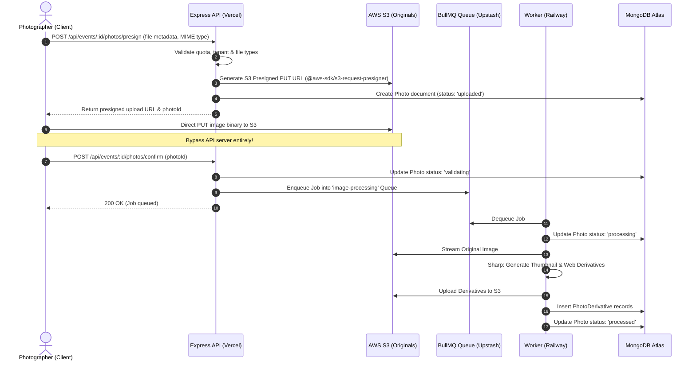

# 📸 PhotoFolio — Technical Architecture & Contributor Onboarding Guide

Welcome to the **PhotoFolio** repository! This document serves as the comprehensive architectural reference and technical onboarding guide for software engineers contributing to the platform.

---

## 📑 Table of Contents
1. [System Overview & Product Vision](#1-system-overview--product-vision)
2. [High-Level Architecture & Tech Stack](#2-high-level-architecture--tech-stack)
3. [Monorepo Package Breakdown](#3-monorepo-package-breakdown)
   - [packages/client (Frontend SPA)](#31-packagesclient-frontend-spa)
   - [packages/server (REST API & Control Plane)](#32-packagesserver-core-api-server)
   - [packages/worker (Async Image & AI Engine)](#33-packagesworker-background-processing-worker)
   - [packages/shared (Core Constants & Contracts)](#34-packagesshared-shared-library)
4. [Critical Technical Pipelines & Data Flows](#4-critical-technical-pipelines--data-flows)
   - [Direct-to-S3 Presigned Upload Pipeline](#41-direct-to-s3-presigned-upload-pipeline)
   - [Async Derivative & Processing Pipeline](#42-async-derivative--processing-pipeline)
   - [Guest Face Matching & Discovery Flow](#43-guest-face-matching--discovery-flow)
5. [Database Schema & Data Models (MongoDB)](#5-database-schema--data-models-mongodb)
6. [Cloud Infrastructure & Production Topology](#6-cloud-infrastructure--production-topology)
7. [Local Development Quickstart](#7-local-development-quickstart)
8. [High-Impact Engineering Roadmap & Contribution Areas](#8-high-impact-engineering-roadmap--contribution-areas)
9. [Code Conventions & Contributor Guidelines](#9-code-conventions--contributor-guidelines)

---

## 1. System Overview & Product Vision

### The Problem
Event photography (weddings, conferences, galas, sporting events) produces thousands of high-resolution images. Traditional distribution methods (Google Drive links, Dropbox, USB drives) are broken:
- Guests must manually sift through thousands of photos to find pictures of themselves.
- Photographers struggle with delivery delays, high bandwidth costs, and complex client proofing.
- Post-event monetization and client engagement opportunities are largely lost.

### The Solution
**PhotoFolio** is a multi-tenant, cloud-native **AI Event Photography SaaS Platform**.
- **For Photographers & Studios:** A modern dashboard to create events, manage branding/watermarks, bulk-upload RAW/JPEG photos via direct-to-S3 presigned uploads, generate branded QR codes, and track client interactions.
- **For Event Guests:** Instant gratification. Guests scan a venue QR code, take a single selfie, and the platform runs facial vector similarity search to instantly deliver every photo they appear in.
- **For Monetization:** Subscription tiers for photographers powered by Razorpay, with automated storage quotas and feature gating.

---

## 2. High-Level Architecture & Tech Stack

PhotoFolio is architected as an event-driven, decoupled system running across specialized compute environments to balance speed, cost, and heavy computational requirements.



### Technology Matrix
| Layer | Technologies Used | Key Purpose |
|---|---|---|
| **Monorepo** | NPM Workspaces (`node >= 18`) | Single repository managing all 4 interdependent packages |
| **Frontend** | React 18, Vite, React Router v6, Axios, Custom CSS | Fast, accessible, reactive UI for dashboard and mobile guests |
| **Backend API** | Express.js, Mongoose, Zod, JWT (`jsonwebtoken`), Pino | REST API, auth, tenant validation, BullMQ job producer |
| **Async Worker** | BullMQ, Sharp, AWS SDK v3, ioredis | Heavy background image resizing, compression, watermarking |
| **Message Queue** | Redis (Upstash) with TLS (`rediss://`) | Reliable FIFO queue with retry policies and backoff |
| **Database** | MongoDB Atlas (Mongoose ODM) | Multi-tenant document store for users, events, photos, face embeddings |
| **Object Storage** | AWS S3 (`ap-south-1`) & AWS CloudFront | Scalable blob storage for originals and multi-size web derivatives |
| **Payments** | Razorpay SDK & Webhooks | Subscription plans and quota enforcement for photographers |

---

## 3. Monorepo Package Breakdown

The codebase is organized under `packages/`:

```
big-photofolio/
├── packages/
│   ├── client/       # React 18 SPA (Photographer Dashboard & Guest Portal)
│   ├── server/       # Express.js REST API server & database layer
│   ├── worker/       # Standalone BullMQ background job processing service
│   └── shared/       # Shared constants, enums, schemas, and utility contracts
├── docs/             # Deployment and operational documentation
├── package.json      # Monorepo root configuration & orchestrator scripts
└── vercel.json       # Vercel deployment routing & serverless configuration
```

---

### 3.1 `packages/client` (Frontend SPA)
The client application is built with modern React using Vite for sub-second HMR and optimized production bundles.

* **Key Directories:**
  * `src/pages/auth/`: Login, Registration, Password Reset flows.
  * `src/pages/dashboard/`: Analytics, recent events, quick upload metrics.
  * `src/pages/events/`: Event creation wizard, QR code generators, gallery management, batch photo uploader.
  * `src/pages/guest/`: Guest onboarding, real-time selfie capture, matched photo stream, image download.
  * `src/pages/subscription/`: Pricing tiers, current usage gauges, Razorpay checkout modal.
  * `src/context/`: Global state management for Authentication (`AuthContext`) and Theme.
  * `src/api/`: Axios client configured with automatic JWT refresh interceptors and base URL configurations.

---

### 3.2 `packages/server` (Core API Server)
The server functions as the central gateway and control plane. It exposes RESTful endpoints, enforces multi-tenancy, and produces background jobs.

* **Key Directories:**
  * `src/routes/`: Express routers segmented by resource (`auth.routes.js`, `event.routes.js`, `upload.routes.js`, `guest.routes.js`, `subscription.routes.js`).
  * `src/controllers/`: Request handling, parameter validation, and response formatting.
  * `src/services/`: Business logic layer (e.g., S3 presigned URL generation, Razorpay subscription lifecycle, photo cleanup routines).
  * `src/models/`: Mongoose models for all MongoDB collections.
  * `src/middleware/`: JWT authentication (`authenticate`), role-based authorization (`authorize`), tenant resolution, rate limiting, and global error handling.
  * `src/config/`: Queue configuration (`queue.js` with BullMQ and ioredis), MongoDB connection, and environment parser.

---

### 3.3 `packages/worker` (Background Processing Worker)
The worker package runs as an independent daemon. It handles high-CPU, I/O-intensive workloads that cannot run inside Vercel's short-lived serverless functions.

* **Key Processors (`src/processors/`):**
  * `imageProcessor.js`:
    1. Downloads raw photo from S3 `photofolio-originals`.
    2. Uses **Sharp** (libvips C-bindings) to generate multi-resolution derivatives:
       - **Thumbnail:** 300px width (for grid previews).
       - **Web:** 1920px max width (compressed for fluid mobile/desktop viewing).
       - **Preview:** Medium resolution.
    3. Conditionally overlays dynamic branding or studio watermarks.
    4. Uploads derivatives directly to `photofolio-derivatives` on S3.
    5. Creates `PhotoDerivative` records and transitions `Photo` status to `processed`.
  * `faceProcessor.js`:
    - Handles facial detection, vector embedding generation, and matching algorithms.
  * `eventDeleteProcessor.js`:
    - Executes asynchronous deep cascades: batches S3 photo deletion and MongoDB record purging when an event is deleted.
* **Extensible AI Architecture (`src/providers/`):**
  * `faceProvider.interface.js`: Formal abstract interface defining `detectFaces()` and `matchFaces()`.
  * `mockFaceProvider.js`: Deterministic development provider for offline testing without cloud AI costs.
  * `providerFactory.js`: Factory pattern allowing seamless swapping between `mock`, AWS Rekognition, or custom Python Face API microservices via environment variables (`FACE_PROVIDER`).

---

### 3.4 `packages/shared` (Shared Library)
A zero-dependency package imported by `client`, `server`, and `worker`.
* Eliminates magic strings and keeps states synchronized across the stack.
* **Constants & Enums:**
  * `PHOTO_STATUS`: `uploaded`, `validating`, `processing`, `processed`, `failed`
  * `EVENT_STATUS`: `draft`, `active`, `archived`, `deleting`, `deleted`
  * `ROLES`: `admin`, `photographer`, `assistant`, `guest`

---

## 4. Critical Technical Pipelines & Data Flows

### 4.1 Direct-to-S3 Presigned Upload Pipeline
Traditional file uploads route data through the web server. For photography apps where a photographer uploads 500+ RAW/JPEG photos (several gigabytes), this causes server crashes, high RAM usage, and serverless timeout errors (Vercel has a 4.5MB request payload limit).

PhotoFolio solves this using **S3 Presigned URLs**:



---

### 4.2 Async Derivative & Processing Pipeline
Once an image reaches the worker:
1. **Safety Checks:** MIME validation and dimension integrity check.
2. **Sharp Pipeline:**
   - Thumbnail generation: `width: 300`, `format: webp/jpeg`, `quality: 80`.
   - Web view generation: `width: 1920`, preserves aspect ratio, progressive scan.
   - Watermarking: SVG/PNG composite overlay with customizable opacity if enabled by tenant settings.
3. **Storage Tiering:** Original image remains safe in `photofolio-originals`; derivatives are saved in `photofolio-derivatives` for low-latency CDN serving.

---

### 4.3 Guest Face Matching & Discovery Flow
1. Guest visits `https://app.photofolio.in/guest/:eventId` via venue QR code.
2. Guest captures a live selfie using their smartphone camera.
3. Client requests a presigned URL to upload the selfie as a `ReferenceFace`.
4. Face matching service extracts the face vector embedding (128-d or 512-d float array).
5. Vector similarity lookup matches the guest's embedding against the event's pre-computed `FaceDetection` index.
6. Photos with confidence above `FACE_MATCH_THRESHOLD` (default 0.6) are linked via `Match` records and displayed in the guest's personalized gallery.

---

## 5. Database Schema & Data Models (MongoDB)

All schemas are located in `packages/server/src/models/`:

| Model | Collection | Primary Responsibility |
|---|---|---|
| **`Tenant`** | `tenants` | Multi-tenant organization profile, branding configuration, custom domain |
| **`User`** | `users` | Photographer/Admin accounts, bcrypt password hashes, role assignments |
| **`Plan` & `Subscription`** | `plans`, `subscriptions` | Billing tier configurations, event limits, storage caps, Razorpay IDs |
| **`Event`** | `events` | Event metadata (name, date, passcode, QR code link, status) |
| **`Photo`** | `photos` | Master image records (S3 original key, dimensions, current processing status) |
| **`PhotoDerivative`** | `photoderivatives` | Child records referencing resized versions (thumbnail, web, preview) in S3 |
| **`FaceDetection`** | `facedetections` | Bounding box coordinates and vector embeddings detected in event photos |
| **`ReferenceFace`** | `referencefaces` | Guest selfie face embeddings used as search queries |
| **`Guest` & `Match`** | `guests`, `matches` | Guest session records and validated linkages between a guest and photos |
| **`ConsentRecord` & `AuditLog`** | `consentrecords`, `auditlogs` | Privacy compliance (GDPR/DPDP), consent tracking, security audit trails |

---

## 6. Cloud Infrastructure & Production Topology

PhotoFolio runs on a cloud infrastructure configured for resilience and cost efficiency:

```
                    +--------------------------------+
                    |          DNS / Domain          |
                    +----------------+---------------+
                                     |
                +--------------------+--------------------+
                |                                         |
     [photofolio.app]                          [api.photofolio.app]
                |                                         |
                v                                         v
     +---------------------+                   +---------------------+
     |   Vercel Frontend   |                   |  Vercel Serverless  |
     |   (React 18 SPA)    |                   |   (Express.js API)  |
     +----------+----------+                   +----------+----------+
                |                                         |
                |                               +---------+---------+
                |                               |                   |
                v                               v                   v
     +--------------------+           +------------------+  +------------------+
     |   AWS CloudFront   |           |  MongoDB Atlas   |  |  Upstash Redis   |
     |  CDN Distribution  |           |  (Replica Set)   |  |   (BullMQ TLS)   |
     +----------+---------+           +--------+---------+  +--------+---------+
                |                              |                     |
                v                              |                     v
     +--------------------+                    |            +------------------+
     |   AWS S3 Buckets   |                    +----------->|  Railway Worker  |
     | Originals / Derivs |<--------------------------------|  (Docker Node18) |
     +--------------------+                                 +------------------+
```

* **Frontend & API Gateway (Vercel):**
  * Auto-deploys from the `main` branch.
  * Serverless endpoints execute fast I/O and DB queries.
* **Worker Service (Railway):**
  * Deployed as a persistent Docker container running Node.js.
  * **Watch Path:** Configured to `/packages/worker/**` to ensure builds only trigger when worker code changes.
  * Auto-reconnects to Redis via TLS (`rediss://`) using IPv4 (`family: 4`).
* **Message Broker (Upstash Redis):**
  * Managed, low-latency Redis cluster handling BullMQ image and face processing queues.
* **Object Storage (AWS S3 ap-south-1):**
  * `photofolio-originals`: Private bucket for high-res photographer uploads.
  * `photofolio-derivatives`: Public/CloudFront bucket for optimized web viewing.

---

## 7. Local Development Quickstart

### Prerequisites
* **Node.js:** `>= 18.0.0` (Node 20 or 22 LTS recommended)
* **NPM:** `>= 9.0.0` (built-in workspace support)
* **MongoDB:** Local MongoDB instance or free MongoDB Atlas URI
* **Redis:** Local Redis server (`localhost:6379`) or free Upstash Redis instance

### Step 1: Clone & Install Dependencies
Clone the repository and install all workspace dependencies from the root directory:
```bash
git clone https://github.com/IPSayush/big-photofolio.git
cd big-photofolio
npm install
```

### Step 2: Configure Environment Variables
Copy the template to `.env` in the project root:
```bash
cp .env.example .env
```
Ensure the following core variables are populated:
```ini
NODE_ENV=development
PORT=5000
MONGODB_URI=mongodb+srv://<user>:<password>@cluster.mongodb.net/photofolio?retryWrites=true&w=majority
REDIS_URL=redis://localhost:6379
JWT_ACCESS_SECRET=your_super_secret_access_key
JWT_REFRESH_SECRET=your_super_secret_refresh_key
AWS_REGION=ap-south-1
AWS_ACCESS_KEY_ID=your_key
AWS_SECRET_ACCESS_KEY=your_secret
S3_BUCKET_ORIGINALS=photofolio-originals
S3_BUCKET_DERIVATIVES=photofolio-derivatives
FACE_PROVIDER=mock
```

### Step 3: Run the Development Services
You can run all three services concurrently or in separate terminal tabs:

**Option A: Dedicated Terminals (Recommended for debugging):**
```bash
# Terminal 1: Backend API Server (Port 5000)
npm run dev:server

# Terminal 2: Background Worker (Consumes BullMQ jobs)
npm run dev:worker

# Terminal 3: Frontend Client (Port 5173 with HMR)
npm run dev:client
```

**Option B: Seed Base Data:**
```bash
# Seed subscription plans into MongoDB
node packages/server/scripts/seedPlans.js
```

Access the frontend at `http://localhost:5173`.

---

## 8. High-Impact Engineering Roadmap & Contribution Areas

We welcome meaningful contributions! Here are the highest-impact architectural initiatives ready for implementation:

### 🌟 1. Production AI Face Recognition Provider
* **Current State:** The system currently relies on `mockFaceProvider.js` which returns simulated bounding boxes and mock vectors.
* **The Opportunity:** Implement a production-grade provider fulfilling `packages/worker/src/providers/faceProvider.interface.js`.
  * **Option A (Cloud Native):** AWS Rekognition (`IndexFaces`, `SearchFacesByImage`).
  * **Option B (Self-Hosted Open Source):** A lightweight Python FastAPI sidecar running **InsightFace** / **ArcFace** on an EC2 GPU/CPU instance communicating via gRPC or REST.
* **Relevant Files:**
  * `packages/worker/src/providers/faceProvider.interface.js`
  * `packages/worker/src/providers/providerFactory.js`
  * `packages/worker/src/processors/faceProcessor.js`

---

### ⚡ 2. Real-Time Processing Updates (WebSockets / SSE)
* **Current State:** The frontend uses short polling (`setInterval`) to check if uploaded photos have transitioned from `validating` to `processed`.
* **The Opportunity:** Introduce **Server-Sent Events (SSE)** or a lightweight WebSocket gateway (e.g. Socket.io with Redis adapter) to stream instant photo progress bar updates directly to the photographer dashboard.
* **Relevant Files:**
  * `packages/server/src/routes/upload.routes.js`
  * `packages/client/src/pages/events/`

---

### 🛡️ 3. Private Gallery Security (CloudFront Signed URLs/Cookies)
* **Current State:** Derivative images are publicly accessible if the S3 URL is known.
* **The Opportunity:** Integrate AWS CloudFront signed cookies or signed URLs for event galleries marked as private/password-protected, ensuring only authorized guests can view or download full-size photos.
* **Relevant Files:**
  * `packages/server/src/services/`
  * `packages/worker/src/s3.js`

---

### 🧪 4. Automated Testing Suite Expansion
* **Current State:** Core models and utilities have initial unit tests using Vitest.
* **The Opportunity:**
  * Build end-to-end integration tests for the S3 upload confirmation flow.
  * Add unit tests for BullMQ worker retry behavior, backoff strategies, and error handling.
* **Relevant Files:**
  * `packages/server/tests/`
  * `packages/worker/tests/`

---

### 📱 5. Mobile PWA & Offline Upload Queue
* **Current State:** Client is a responsive web app.
* **The Opportunity:** Implement an **IndexedDB background sync queue** in the React client. When photographers are shooting at outdoor venues with spotty cellular reception, photos queue locally and auto-resume uploading once the network reconnects.
* **Relevant Files:**
  * `packages/client/src/hooks/`
  * `packages/client/src/components/`

---

## 9. Code Conventions & Contributor Guidelines

1. **Strict Separation of Concerns:**
   - **No heavy compute in `packages/server`:** All resizing, hashing, and ML tasks belong in `packages/worker`.
   - **No business logic in controllers:** Keep Express controllers thin; delegate orchestration to `services/`.
2. **Always Use `packages/shared` for Constants:**
   - Never hardcode string statuses like `'processed'` or `'active'`. Always import from `@photofolio/shared`.
3. **Structured Logging:**
   - Use Pino logger (`logger.info({ context }, 'message')`). Do not leave raw `console.log` statements in production code.
4. **Git Workflow:**
   - Create focused feature branches (`feature/aws-rekognition-provider`, `fix/s3-presign-mime`).
   - Write clear, imperative commit messages.
   - Test your changes locally before opening a Pull Request.

---

### 💬 Questions or Need Help?
Feel free to open an issue or coordinate directly with the team. Happy hacking! 🚀