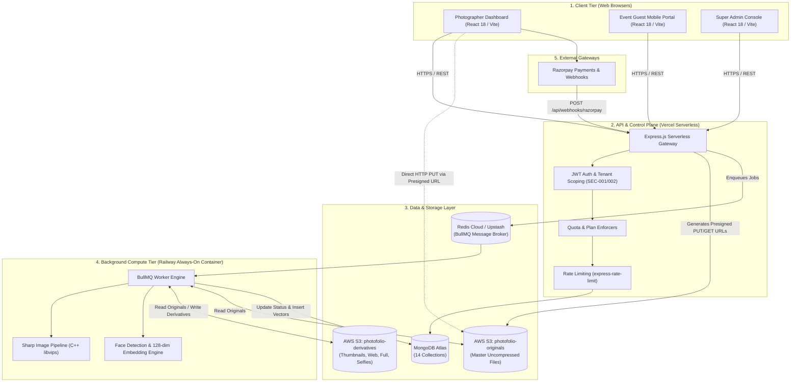
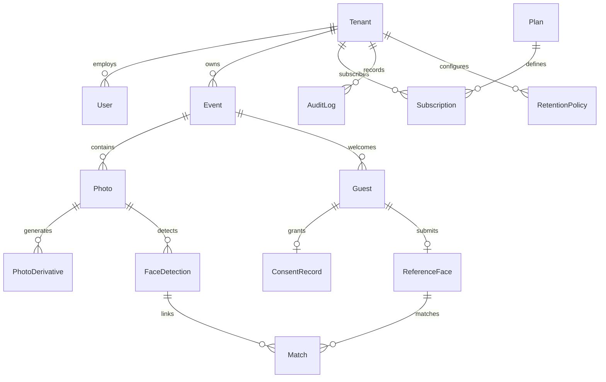
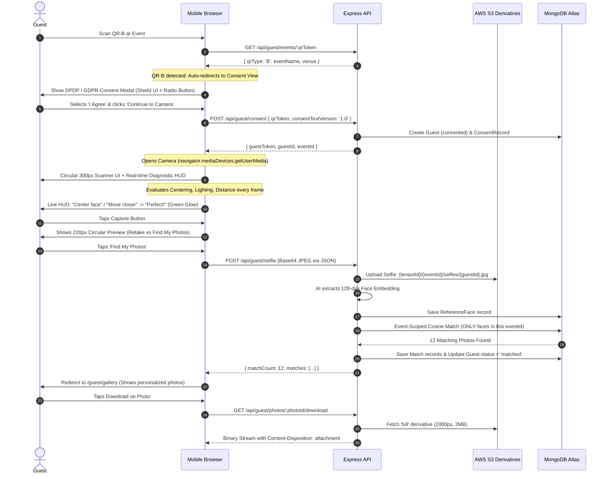
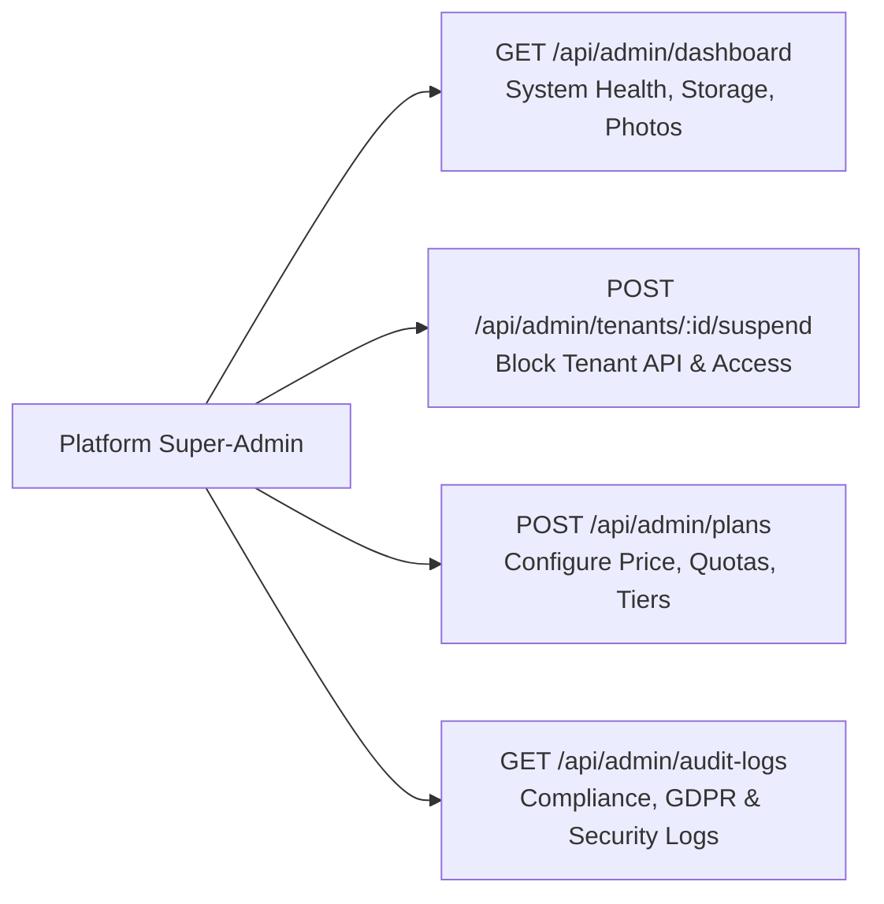

# 📑 PhotoFolio — Master System Workflow & End-to-End Technical Architecture (v2.0)

> **Document Status:** Complete & Production-Synchronized  
> **Target Audience:** Engineering Leads, Full-Stack Developers, Cloud Architects, and Technical Stakeholders  
> **Applicable Stack:** React 18 (Vite) | Express.js Serverless (Vercel) | BullMQ Worker (Railway) | MongoDB Atlas | AWS S3 Dual-Bucket | Redis (Upstash) | Razorpay

---

## 📌 Table of Contents
1. [System Blueprint & Executive Summary](#1-system-blueprint--executive-summary)
2. [Global Architecture & Tech Stack Topology](#2-global-architecture--tech-stack-topology)
3. [The 14 MongoDB Collections & Data Schema](#3-the-14-mongodb-collections--data-schema)
4. [Workflow 1: Photographer Lifecycle & Event Management](#4-workflow-1-photographer-lifecycle--event-management)
   - [4.1 Registration & Studio Account Setup](#41-registration--studio-account-setup)
   - [4.2 Authentication, JWT Lifecycle & Multi-Tenant Scoping](#42-authentication-jwt-lifecycle--multi-tenant-scoping)
   - [4.3 Subscription Plan Selection & Razorpay Billing Webhook](#43-subscription-plan-selection--razorpay-billing-webhook)
   - [4.4 Event Creation & The Dual QR Code Architecture (QR-A vs QR-B)](#44-event-creation--the-dual-qr-code-architecture-qr-a-vs-qr-b)
   - [4.5 Bulk Photo Upload via Direct S3 Presigned Handshake](#45-bulk-photo-upload-via-direct-s3-presigned-handshake)
   - [4.6 Real-Time Ingestion Status Monitoring & Failure Recovery](#46-real-time-ingestion-status-monitoring--failure-recovery)
5. [Workflow 2: Background Processing Worker Pipeline (Railway Container)](#5-workflow-2-background-processing-worker-pipeline-railway-container)
   - [5.1 Architecture of the 3 BullMQ Queues](#51-architecture-of-the-3-bullmq-queues)
   - [5.2 Queue 1: Image Processing Pipeline & Derivative Generation](#52-queue-1-image-processing-pipeline--derivative-generation)
   - [5.3 Exact Image Derivative Specifications & Dimensions](#53-exact-image-derivative-specifications--dimensions)
   - [5.4 Queue 2: AI Face Detection, Vector Embedding & Event-Scoped Indexing](#54-queue-2-ai-face-detection-vector-embedding--event-scoped-indexing)
   - [5.5 Queue 3: Cascade Event Deletion & Storage Purge](#55-queue-3-cascade-event-deletion--storage-purge)
6. [Workflow 3: Guest Experience & Delivery Journey](#6-workflow-3-guest-experience--delivery-journey)
   - [6.1 Path A: Public Gallery Browsing (QR-A Flow)](#61-path-a-public-gallery-browsing-qr-a-flow)
   - [6.2 Path B: Biometric Face-Match & Instant Discovery (QR-B Flow - Redesigned)](#62-path-b-biometric-face-match--instant-discovery-qr-b-flow---redesigned)
   - [6.3 DPDP Act 2023 & GDPR Privacy Consent Modal](#63-dpdp-act-2023--gdpr-privacy-consent-modal)
   - [6.4 Live Camera Face Scanner UI (Real-Time Heuristics & Diagnostics)](#64-live-camera-face-scanner-ui-real-time-heuristics--diagnostics)
   - [6.5 Base64 Selfie Ingestion, Vector Extraction & Cosine Matching](#65-base64-selfie-ingestion-vector-extraction--cosine-matching)
   - [6.6 Personalized Gallery Delivery & Consent Withdrawal (Right to be Forgotten)](#66-personalized-gallery-delivery--consent-withdrawal-right-to-be-forgotten)
7. [Workflow 4: Platform Administration & Compliance Control](#7-workflow-4-platform-administration--compliance-control)
   - [7.1 Super-Admin Health & Telemetry Metrics](#71-super-admin-health--telemetry-metrics)
   - [7.2 Tenant Suspension & Reinstatement Protocol](#72-tenant-suspension--reinstatement-protocol)
   - [7.3 Dynamic Subscription Plan CRUD & Quota Gating](#73-dynamic-subscription-plan-crud--quota-gating)
8. [Critical Security, Performance & FAQ Deep Dives](#8-critical-security-performance--faq-deep-dives)
   - [8.1 Why Photos Between Event X and Event Y NEVER Mix](#81-why-photos-between-event-x-and-event-y-never-mix)
   - [8.2 Why Face Search Compares 600 Faces, NOT 10,000 S3 Photos](#82-why-face-search-compares-600-faces-not-10000-s3-photos)
   - [8.3 Large Batch Upload Wait Times & S3 Bandwidth Offloading](#83-large-batch-upload-wait-times--s3-bandwidth-offloading)
   - [8.4 Download Resolution Strategy: Guest vs Photographer](#84-download-resolution-strategy-guest-vs-photographer)
   - [8.5 Multi-Tenant Isolation & Zero Cross-Tenant Leakage Controls](#85-multi-tenant-isolation--zero-cross-tenant-leakage-controls)
9. [Complete API Reference Master Index](#9-complete-api-reference-master-index)

---

## 1. System Blueprint & Executive Summary

### 1.1 The Problem It Solves
Traditional event photography distribution (weddings, corporate conferences, sporting events) produces thousands of high-resolution images. Current delivery methods (Google Drive, Dropbox, USB drives) fail because:
1. **The Guest Burden:** Attendees must manually scroll through 2,000 to 10,000 photos to find 5 photos of themselves.
2. **The Photographer Burden:** Uploading uncompressed 50 MB RAW/JPEG files saturates servers, runs up astronomical bandwidth bills, and provides zero proofing automation.

### 1.2 The PhotoFolio Solution
PhotoFolio is an enterprise-grade, multi-tenant SaaS platform that automates high-volume photography delivery through AI-driven facial recognition:
- **Direct-to-S3 Offloading:** Client browsers upload directly to AWS S3 using presigned URLs, keeping application servers free of heavy I/O.
- **Asynchronous Compute Pipeline:** Railway background workers generate lightweight web derivatives and run facial vector indexing in decoupled BullMQ queues.
- **Dual QR Architecture:** Photographers print two distinct QR codes at venues:
  - **QR-A (Gallery QR):** Direct browsable gallery for all approved public photos.
  - **QR-B (Find My Photos QR):** Seamless face scanner that auto-matches the guest's selfie with photos from **that specific event only**.
- **DPDP Act 2023 & GDPR Compliance:** Built-in biometric consent popups, event-scoped vector isolation, and self-service one-click consent withdrawal (complete biometric erasure).

---

## 2. Global Architecture & Tech Stack Topology



| Architectural Component | Platform / Technology | Purpose |
|---|---|---|
| **Frontend SPA** | React 18, Vite, Vanilla CSS | Single-page application for Photographers, Guests, and Super-Admins |
| **Backend REST API** | Node.js, Express.js (Vercel Serverless) | Stateless control plane, authentication, routing, presigned URL issuer |
| **Worker Engine** | Node.js, BullMQ (Railway Container) | Always-on background daemon consuming jobs from Redis queues |
| **Image Processing** | Sharp (`libvips`) | Multi-threaded image validation, resizing, WebP/JPEG compression |
| **Database** | MongoDB Atlas (Mongoose ODM) | Multi-tenant schema holding 14 operational collections |
| **Queue Broker** | Redis (Upstash / Redis Cloud) | Distributed Redis backend for BullMQ job queues |
| **Object Storage 1** | AWS S3 (`photofolio-originals`) | Private, encrypted bucket storing master camera files (50 MB+) |
| **Object Storage 2** | AWS S3 (`photofolio-derivatives`) | Optimized bucket storing generated thumbs, web, full, and selfies |
| **Payment Gateway** | Razorpay Node SDK | Automated subscription checkout, order creation, and webhooks |

---

## 3. The 14 MongoDB Collections & Data Schema

PhotoFolio maintains strict data normalization and multi-tenant scoping across 14 collections:



### Schema Summary Table

| Collection | Model File | Purpose & Key Attributes |
|---|---|---|
| **Users** | `User.js` | Photographer & Admin credentials. Fields: `email`, `password` (bcrypt), `role` (`PHOTOGRAPHER`, `ADMIN`), `tenantId`, `avatarUrl`, `emailVerified`. |
| **Tenants** | `Tenant.js` | Business entity. Root of isolation. Fields: `businessName`, `logo`, `brandingColors`, `contactEmail`, `status` (`ACTIVE`, `SUSPENDED`), `planId`. |
| **Events** | `Event.js` | Photography events. Fields: `tenantId`, `name`, `date`, `venue`, `accessMode`, `qrAToken` (Gallery), `qrBToken` (Biometric), `status`. |
| **Photos** | `Photo.js` | Master photo records. Fields: `tenantId`, `eventId`, `s3Key`, `originalFilename`, `fileSize`, `status` (`pending`, `uploaded`, `validating`, `processing`, `processed`, `failed`), `hash`. |
| **PhotoDerivatives** | `PhotoDerivative.js` | Worker-generated derivatives. Fields: `photoId`, `tenantId`, `eventId`, `derivativeType` (`thumb`, `web`, `full`), `s3Key`, `width`, `height`, `fileSize`. |
| **Guests** | `Guest.js` | Ephemeral event attendees. Fields: `eventId`, `guestToken`, `status` (`invited`, `consented`, `selfie_uploaded`, `matched`, `withdrawn`). |
| **ConsentRecords** | `ConsentRecord.js` | DPDP/GDPR audit trail. Fields: `guestId`, `eventId`, `consentTextVersion`, `acceptedAt`, `ipAddress`, `userAgent`. |
| **ReferenceFaces** | `ReferenceFace.js` | Guest selfie embeddings. Fields: `guestId`, `eventId`, `s3Key`, `embedding` (128-dim Float32 array), `qualityScore`. |
| **FaceDetections** | `FaceDetection.js` | Faces detected in event photos. Fields: `photoId`, `eventId`, `tenantId`, `boundingBox` (`x`, `y`, `w`, `h`), `embedding` (128-dim Float32 array). |
| **Matches** | `Match.js` | Links between guests and photos. Fields: `guestId`, `photoId`, `eventId`, `similarity` (cosine score), `notifiedAt`. |
| **Plans** | `Plan.js` | Subscription tiers. Fields: `name` (Free Trial, Pro, Enterprise), `price`, `maxEvents`, `maxPhotosPerEvent`, `maxGuestsPerEvent`, `storageLimitGb`. |
| **Subscriptions** | `Subscription.js` | Active billing states. Fields: `tenantId`, `planId`, `razorpaySubscriptionId`, `status` (`active`, `past_due`, `cancelled`), `currentPeriodEnd`. |
| **AuditLogs** | `AuditLog.js` | Security and governance logs. Fields: `tenantId`, `userId`, `action`, `resourceType`, `resourceId`, `ip`, `timestamp`. |
| **RetentionPolicies** | `RetentionPolicy.js` | Storage lifecycle rules. Fields: `tenantId`, `autoDeleteEventDays`, `deleteGuestDataAfterHours`. |

---

## 4. Workflow 1: Photographer Lifecycle & Event Management

```mermaid
sequenceDiagram
    autonumber
    actor P as Photographer
    participant FE as React Client
    participant API as Express API (Vercel)
    participant S3 as AWS S3 Originals
    participant DB as MongoDB Atlas
    participant Q as BullMQ Redis Queue

    P->>FE: Register / Login
    FE->>API: POST /api/auth/login
    API->>DB: Verify credentials (bcrypt)
    DB-->>API: User & Tenant Record
    API-->>FE: JWT Access Token (15m) + Refresh Token (7d)

    P->>FE: Create New Event
    FE->>API: POST /api/events
    API->>API: Enforce Tenant Scope & Quota Check
    API->>DB: Insert Event (Generate qrAToken & qrBToken)
    DB-->>API: Event Document
    API-->>FE: Event Created + 2 QR URLs

    P->>FE: Select 50 Photos (e.g. 50MB each)
    FE->>API: POST /api/events/:id/photos/upload-url (metadata batch)
    API->>API: Check maxPhotosPerEvent quota
    API->>DB: Create Photo docs (status: pending)
    API->>API: Generate AWS S3 Pre-signed PUT URLs
    API-->>FE: Return Pre-signed URLs for each photo

    rect rgb(30, 45, 60)
    Note over FE,S3: Direct-to-S3 Parallel Upload (Bypasses API Server)
    loop For each file (Parallel Workers 3-5)
        FE->>S3: HTTP PUT {presignedUrl} with raw image binary
        S3-->>FE: 200 OK (Uploaded directly)
    end
    end

    FE->>API: POST /api/events/:id/photos/confirm (photoIds: [...])
    API->>DB: Update Photo.status = 'uploaded'
    API->>Q: Enqueue jobs to 'image-processing' queue
    API-->>FE: 200 OK (Confirmed: 50)
    Note over P,FE: Photographer is FREE to close tab! Processing runs in background.
```



### 4.1 Registration & Studio Account Setup
- **Endpoint:** `POST /api/auth/register`
- **Payload:** `{ name, email, password, businessName }`
- **Behind the Scenes:**
  1. `password` is hashed using `bcryptjs` with a work factor of 12 rounds.
  2. Creates a `Tenant` document representing the photography business.
  3. Creates a `User` document linked to the newly minted `tenantId`.
  4. Generates an email verification token (saved with expiry in DB).
  5. Returns JWT tokens and sets `req.tenantId`.

### 4.2 Authentication, JWT Lifecycle & Multi-Tenant Scoping
- **Endpoint:** `POST /api/auth/login`
- **Payload:** `{ email, password }`
- **Behind the Scenes:**
  1. Validates user status (`ACTIVE`).
  2. Emits short-lived Access Token (15 min) and long-lived Refresh Token (7 days).
  3. **Critical Middleware (`enforceTenantScope.js`):**
     - Extracts `tenantId` directly from verified JWT claims.
     - Never trusts client-supplied tenant query parameters or body attributes (`SEC-002`).
     - Re-verifies tenant status against the database on each API call.

### 4.3 Subscription Plan Selection & Razorpay Billing Webhook
- **Endpoints:**
  - `GET /api/plans` — Retrieves available subscription tiers.
  - `POST /api/subscriptions` — Initiates Razorpay checkout order.
  - `POST /api/webhooks/razorpay` — Handles automated subscription events.
- **Behind the Scenes:**
  - The webhook verifies the Razorpay signature (`x-razorpay-signature`) using HMAC SHA-256.
  - On `subscription.charged`: updates `Subscription.status = 'active'` and updates `Tenant.planId`.
  - Upgrades or downgrades immediately update tenant quota enforcement.

### 4.4 Event Creation & The Dual QR Code Architecture (QR-A vs QR-B)
- **Endpoint:** `POST /api/events`
- **Payload:** `{ name, date: { start, end }, venue, accessMode }`
- **Behind the Scenes:**
  1. Checks `checkEventQuota` against current subscription limits.
  2. Generates **two cryptographically secure unique tokens** (`crypto.randomBytes(16).toString('hex')`):
     - **`qrAToken` (General Gallery QR):**
       - URL: `https://domain.com/guest/events/{qrAToken}`
       - Purpose: Public browsing. Guests can see all approved event photos in a chronological masonry grid.
     - **`qrBToken` (Biometric Face-Match QR):**
       - URL: `https://domain.com/guest/events/{qrBToken}`
       - Purpose: Personalized discovery. Instantly triggers the privacy consent modal followed by the live face scanner.

### 4.5 Bulk Photo Upload via Direct S3 Presigned Handshake
To eliminate memory and timeout limits on Vercel serverless functions, upload is entirely decoupled from the API:
1. **Request Presigned URLs:**
   - `POST /api/events/:eventId/photos/upload-url`
   - Body: `{ files: [{ fileName, contentType, sizeBytes, hash }] }`
   - Server validates MIME types (JPEG, PNG, WebP) and checks SHA-256 duplicate hashes.
   - Creates `Photo` records with status `'pending'`.
   - Generates AWS S3 `PutObjectCommand` Presigned URLs (15-minute validity).
   - Target S3 Key: `{tenantId}/{eventId}/originals/{photoId}.{ext}` in bucket `photofolio-originals`.
2. **Direct Browser Upload:**
   - Frontend performs parallel `fetch(presignedUrl, { method: 'PUT', body: file })`.
   - Data streams directly to AWS S3 data centers.
3. **Ingestion Confirmation:**
   - `POST /api/events/:eventId/photos/confirm` with `{ photoIds: [...] }`.
   - Server marks photos as `'uploaded'` and enqueues jobs to Redis.

### 4.6 Real-Time Ingestion Status Monitoring & Failure Recovery
- **Endpoint:** `GET /api/events/:eventId/photos/status`
- **Response:** `{ total: 50, pending: 0, uploaded: 0, validating: 2, processing: 8, processed: 40, failed: 0 }`
- Photographers can monitor live progress bars. If a photo fails due to corruption:
  - `POST /api/events/:eventId/photos/retry` — Re-enqueues failed photos.
  - `POST /api/events/:eventId/photos/reprocess` — Recovers photos stuck in validation.

---

## 5. Workflow 2: Background Processing Worker Pipeline (Railway Container)

```mermaid
flowchart TD
    subgraph BullMQQueue ["BullMQ Queues (Redis on Railway)"]
        Q1["1. image-processing Queue"]
        Q2["2. face-processing Queue"]
        Q3["3. event-delete Queue"]
    end

    subgraph Q1Pipeline ["Q1: Image Processing Pipeline"]
        D1["Download Original from S3"] --> V1["Sharp Image Validation
Status: validating"]
        V1 --> G1["Sharp Resize & Compression
Status: processing"]
        G1 --> UP1["Upload 3 Derivatives to S3 Derivatives Bucket"]
        UP1 --> DB1["Upsert PhotoDerivative records
Photo.status = processed"]
        DB1 --> ENQ2["Enqueue Job to Q2 (face-processing)"]
    end

    subgraph Q2Pipeline ["Q2: Face Processing Pipeline"]
        D2["Download 'web' Derivative (1200px)"] --> FD2["AI Face Detection
Detect all faces & bounding boxes"]
        FD2 --> EMB2["Generate 128-dim Vector Embeddings"]
        EMB2 --> DB2["Insert FaceDetection records"]
        DB2 --> MATCH2["Cosine Similarity Matching
against Event ReferenceFaces"]
        MATCH2 --> DBM2["Insert Match records for guest"]
    end

    subgraph Q3Pipeline ["Q3: Event Cascade Delete Pipeline"]
        DEL_MATCH["Delete Matches"] --> DEL_FD["Delete FaceDetections"]
        DEL_FD --> DEL_DERIV["Delete PhotoDerivatives"]
        DEL_DERIV --> DEL_PHOTO["Delete Photos"]
        DEL_PHOTO --> DEL_GUEST["Delete Guests, Consents, Selfies"]
        DEL_GUEST --> S3_PURGE["S3 DeleteObjects (1000/batch)
Purge tenantId/eventId/*"]
        S3_PURGE --> DEL_EVT["Delete Event Record"]
    end

    Q1 --> Q1Pipeline
    Q2 --> Q2Pipeline
    Q3 --> Q3Pipeline
```



### 5.1 Architecture of the 3 BullMQ Queues
The worker runs on Railway as an isolated, always-on container with persistent memory and high CPU priority:
- **Concurrency:** Configured to process 2 images concurrently to balance memory usage under Sharp.
- **Lock Expiration:** 120 seconds with automatic heartbeats to prevent stalled jobs.
- **Fault Tolerance:** 3 automatic retry attempts with exponential backoff before marking a photo as `failed`.

### 5.2 Queue 1: Image Processing Pipeline & Derivative Generation
- **Job Payload:** `{ photoId, tenantId, eventId, s3OriginalKey }`
- **Step 1: Download & Validate:** Streams binary from `photofolio-originals`. Sharp inspects headers. If unreadable, job fails with `CORRUPTED_IMAGE`.
- **Step 2: Status Update:** Sets `Photo.status = 'validating'` then `'processing'`.
- **Step 3: Multi-Derivative Generation:** Sharp compiles three distinct derivative buffers.
- **Step 4: Upload to S3:** Pushes buffers to `photofolio-derivatives` bucket.
- **Step 5: Database Commit:** Creates 3 `PhotoDerivative` records and sets `Photo.status = 'processed'`.
- **Step 6: Trigger Next Stage:** Automatically pushes a job to `face-processing`.

### 5.3 Exact Image Derivative Specifications & Dimensions

| Derivative Type | Bounding Dimension | File Format | Compression / Quality | Target File Size | Architectural Purpose |
|---|---|---|---|---|---|
| **Thumbnail (`thumb`)** | **200px** (Aspect preserved) | WebP / JPEG | 75% Quality, stripped EXIF | **15 KB – 40 KB** | Ultra-fast gallery masonry grid rendering. Loads 100+ photos in < 1 second. |
| **Web-Optimized (`web`)** | **1200px** (Max width) | JPEG | 80% Quality, sRGB | **200 KB – 500 KB** | Lightbox modal preview, mobile screen display, and **AI Face Detection input**. |
| **Full Display (`full`)** | **2000px** (Max width) | High-Quality JPEG | 88% Quality, progressive | **1.5 MB – 2.5 MB** | Standard guest downloads, social media sharing, crystal-clear 4x6 / 5x7 prints. |
| *Original Master* | *Full Camera Sensor (e.g. 6000x4000)* | *Original RAW/JPEG* | *100% Unmodified* | *Original (~50 MB)* | Stored in `photofolio-originals` as master archive for photographer downloads. |

### 5.4 Queue 2: AI Face Detection, Vector Embedding & Event-Scoped Indexing
- **Job Payload:** `{ photoId, tenantId, eventId, s3DerivativeKey }`
- **Step 1: Downstream Fetch:** Downloads the lightweight `web` (1200px) derivative from S3.
- **Step 2: Face Localization:** The facial recognition pipeline scans the image and identifies all human faces, calculating coordinates `[x, y, width, height]`.
- **Step 3: Biometric Extraction:** Computes a normalized **128-dimensional floating-point vector embedding** for each face.
- **Step 4: Database Storage:** Saves each face into the `FaceDetections` collection, indexed by `eventId`.
- **Step 5: Incremental Matching:**
  - Queries all existing `ReferenceFace` documents for that specific `eventId`.
  - Calculates the cosine distance between the detected face embedding and each guest selfie embedding:
    $$\text{Similarity} = \frac{\mathbf{A} \cdot \mathbf{B}}{\|\mathbf{A}\| \|\mathbf{B}\|}$$
  - If similarity $\ge 0.82$, creates a `Match` record linking the `guestId` to the `photoId`.

### 5.5 Queue 3: Cascade Event Deletion & Storage Purge
Triggered when a photographer deletes an event (`DELETE /api/events/:id`):
1. Deletes all `Match` documents matching `eventId`.
2. Deletes all `FaceDetection` documents matching `eventId`.
3. Deletes all `PhotoDerivative` documents matching `eventId`.
4. Deletes all `Photo` documents matching `eventId`.
5. Deletes all `ConsentRecord`, `ReferenceFace`, and `Guest` documents.
6. **S3 Bulk Deletion:** Issues AWS `DeleteObjectsCommand` in batches of 1,000 keys for both `photofolio-originals` and `photofolio-derivatives` matching the prefix `{tenantId}/{eventId}/`.
7. Deletes the `Event` document and logs the cascade deletion to `AuditLog`.

---

## 6. Workflow 3: Guest Experience & Delivery Journey



### 6.1 Path A: Public Gallery Browsing (QR-A Flow)
1. **Scan QR-A:** Guest scans venue poster linking to `/guest/events/:qrToken`.
2. **Metadata Fetch:** `GET /api/guest/events/:qrToken` returns `qrType: 'A'`.
3. **Public Landing:** Renders the photographer's branding, event title, dates, and venue description.
4. **Gallery Retrieval:** `GET /api/guest/events/:qrToken/gallery` loads all photos that have reached `status: 'processed'`.
5. **Interactive Lightbox:** Allows guests to view photos fullscreen with keyboard/swipe controls.
6. **Download:** `GET /api/guest/photos/:photoId/download` delivers the high-resolution 2000px Full Display derivative.

### 6.2 Path B: Biometric Face-Match & Instant Discovery (QR-B Flow - Redesigned)
The redesigned QR-B flow eliminates friction, forms, and confusion:
- **Instant Redirection:** Scanning QR-B bypasses all intermediate landing pages and directly routes to `/guest/consent/:qrToken`.
- **Zero Form Entry:** The guest does NOT enter their name, phone, or email. The entire experience is powered by an ephemeral cryptographic session token.

### 6.3 DPDP Act 2023 & GDPR Privacy Consent Modal
Before hardware camera access is requested, the application renders a compliance modal:
- **Visual Design:** Dark glassmorphism modal with glowing blue shield badge.
- **Explicit Disclosures:**
  - *Data Collected:* One selfie photo and its derived 128-dimensional biometric mathematical vector.
  - *Data Purpose:* Identifying photos from this specific event only.
  - *Data Sharing:* Never sold, never shared, completely inaccessible to third parties.
  - *User Rights:* Immediate right to withdraw consent and delete all biometric records at any time.
- **Compliance Badges:** **DPDP Act 2023** and **GDPR Compliant**.
- **Action:** Guest must select the single radio button: *"I accept the data privacy terms..."*, which activates the *"Continue to Camera"* button.
- **Backend Logging:** Calls `POST /api/guest/consent`. Records guest IP, browser user-agent, timestamp, and legal notice version string into `ConsentRecords`.

### 6.4 Live Camera Face Scanner UI (Real-Time Heuristics & Diagnostics)
Once consent is submitted, the device camera activates directly via `navigator.mediaDevices.getUserMedia`:
- **Circular Scanner Viewport:** An elegant 300px circular viewfinder with corner targeting brackets, animated laser sweep line, and dark backdrop blur.
- **Real-Time Client-Side Heuristics:**
  An embedded HTML5 Canvas analysis loop evaluates video frames at 60 FPS using color luminance and skin-tone clustering heuristics:

| Diagnostic Metric | Detection Condition | Live HUD Warning | Frame Visual State |
|---|---|---|---|
| **No Face Found** | Skin pixel clustering < 5% | *"Position your face inside the circle"* | Neutral Cyan border |
| **Too Far Away** | Face area < 12% of viewfinder | *"Move closer to the camera"* | Amber Warning border |
| **Too Close** | Face area > 65% of viewfinder | *"Move back slightly"* | Amber Warning border |
| **Off Center** | Horizontal/vertical center offset > 20% | *"Center your face in the frame"* | Amber Warning border |
| **Poor Lighting** | Average RGB luminance < 50 | *"Find better lighting"* | Amber Warning border |
| **Optimal Alignment** | Centered, balanced lighting, 20%–50% area | *"Perfect! Hold still and capture"* | **Vibrant Green Glow & Pulse Animation** |

- **Instant Capture:** Tapping the shutter button grabs the frame from the video track onto a canvas and shuts off the camera hardware immediately to save battery.

### 6.5 Base64 Selfie Ingestion, Vector Extraction & Cosine Matching
1. **Selfie Review:** Guest inspects their captured selfie inside a 220px circular preview frame. They can tap *"Retake"* to reopen the camera or *"Find My Photos"* to proceed.
2. **Transmission:** The client encodes the canvas snapshot as a JPEG base64 string (`quality: 0.90`) and submits it via `POST /api/guest/selfie` with header `Authorization: Guest {guestToken}`.
3. **S3 Archival:** Server decodes the base64 binary and stores it in `photofolio-derivatives` at:
   `{tenantId}/{eventId}/selfies/{guestId}.jpg`
4. **Facial Extraction:** The AI engine computes the 128-dimensional embedding vector.
5. **Event-Scoped Similarity Search:**
   The backend executes a vector similarity comparison **strictly filtered by the current event**:
   ```javascript
   const eventFaces = await FaceDetection.find({ eventId: currentEventId });
   const matches = eventFaces.filter(face => {
     return cosineSimilarity(face.embedding, guestEmbedding) >= SIMILARITY_THRESHOLD;
   });
   ```
6. **Matching Persistence:** Creates `Match` documents linking the guest to each matching photo.
7. **Status Update:** Marks `Guest.status = 'matched'`.

### 6.6 Personalized Gallery Delivery & Consent Withdrawal (Right to be Forgotten)
- **Personalized Gallery:** The guest is routed to `/guest/gallery`. `GET /api/guest/gallery` (with header `x-guest-token`) queries the `Matches` collection and returns only photos containing the guest.
- **One-Click Consent Withdrawal:**
  In compliance with DPDP Act Section 6 and GDPR Article 17, guests have an omnipresent *"Delete My Data"* action:
  - **Endpoint:** `POST /api/guest/consent/withdraw`
  - **Action:** Instantly deletes:
    1. The selfie file from AWS S3.
    2. The `ReferenceFace` vector record from MongoDB.
    3. All associated `Match` records.
    4. Updates `Guest.status = 'withdrawn'`.
    5. Destroys the guest session token.

---

## 7. Workflow 4: Platform Administration & Compliance Control



### 7.1 Super-Admin Health & Telemetry Metrics
- **Endpoint:** `GET /api/admin/dashboard`
- **Response:** Aggregates system-wide statistics: total registered studios/tenants, total active events, total photos hosted, AWS S3 storage consumption in GB, BullMQ queue depths, and worker latency.

### 7.2 Tenant Suspension & Reinstatement Protocol
- **Endpoints:**
  - `POST /api/admin/tenants/:tenantId/suspend`
  - `POST /api/admin/tenants/:tenantId/reinstate`
- **Action:** Sets `Tenant.status = 'SUSPENDED'`. The `enforceTenantScope` middleware instantly rejects any subsequent API calls originating from that tenant's photographers with a `403 FORBIDDEN` (`TENANT_SUSPENDED`).

### 7.3 Dynamic Subscription Plan CRUD & Quota Gating
Super-admins create and modify subscription tiers without deploying code:
- **Endpoints:** `GET /api/admin/plans`, `POST /api/admin/plans`, `PUT /api/admin/plans/:planId`, `PATCH /api/admin/plans/:planId/status`.
- **Gated Quotas:**
  - `maxEvents`: Maximum active events a photographer can host concurrently.
  - `maxPhotosPerEvent`: Cap on total photos allowed in a single event.
  - `maxGuestsPerEvent`: Cap on distinct guest face searches per event.
  - `storageLimitGb`: Storage ceiling enforcing hard stops on uploads.

---

## 8. Critical Security, Performance & FAQ Deep Dives

### 8.1 Why Photos Between Event X and Event Y NEVER Mix
A frequent architectural question is whether photos from Event X and Event Y could ever get mixed if uploaded by the same photographer.

**Answer: It is mathematically and architecturally impossible for photos to mix.**

1. **Storage Separation in AWS S3:**
   Every file uploaded to S3 is namespaced by both `tenantId` and `eventId`:
   - Event X Originals: `photofolio-originals/{tenantId}/event_X_id/originals/{photoId}.jpg`
   - Event Y Originals: `photofolio-originals/{tenantId}/event_Y_id/originals/{photoId}.jpg`
   - Event X Derivatives: `photofolio-derivatives/{tenantId}/event_X_id/derivatives/{photoId}_thumb.jpg`
   - Event Y Derivatives: `photofolio-derivatives/{tenantId}/event_Y_id/derivatives/{photoId}_thumb.jpg`
2. **Database Isolation in MongoDB:**
   Every single record in `Photos`, `PhotoDerivatives`, `FaceDetections`, and `Matches` contains a mandatory, indexed `eventId` field:
   ```javascript
   // Query always includes the explicit eventId filter
   const photos = await Photo.find({ tenantId, eventId, status: 'processed' });
   ```
3. **Guest QR Isolation:**
   QR-A and QR-B encode distinct tokens linked to one specific `Event` document. A guest scanning Event Y's QR code only has authorization to query data where `eventId === eventY._id`.

---

### 8.2 Why Face Search Compares 600 Faces, NOT 10,000 S3 Photos
If the platform holds 10,000 total photos in AWS S3 across 20 events, does scanning a selfie search through all 10,000 photos?

**Answer: No. It never searches all 10,000 photos, and it never searches S3 directly.**

1. **S3 is Not a Search Engine:** AWS S3 only stores binary image files. S3 is never queried during a face scan.
2. **Event-Scoped Vector Filtering:**
   All biometric face matching occurs in memory against pre-computed mathematical vectors filtered strictly by `eventId`:
   ```
   Total Photos in S3: 10,000 photos
   Photos in Event Y: 300 photos
   Faces Detected in Event Y: 600 faces (stored in MongoDB FaceDetections)
   
   Cosine Search Space: Exactly 600 vectors (128 floats each)
   Execution Time: 80 ms – 250 ms
   ```
3. **Cross-Event Privacy Guarantee:** Even if a guest attended both Event X and Event Y, scanning Event Y's QR code will **only** return photos taken at Event Y. To view photos from Event X, the guest must scan Event X's QR code.

---

### 8.3 Large Batch Upload Wait Times & S3 Bandwidth Offloading
When a photographer uploads 50 photos of 50 MB each (2.5 GB total):
1. **Presigned Uploads Bypass Backend Servers:**
   The 2.5 GB of binary data flows directly from the photographer's browser to AWS S3. The Vercel serverless backend only handles a tiny JSON handshake (< 5 KB), eliminating server crashes and memory exhaustion.
2. **Parallel Upload Streams:**
   The frontend uploads 3 to 5 files simultaneously, saturating the user's local uplink. On a 50 Mbps upload connection, 2.5 GB completes in ~5 to 6 minutes.
3. **Zero Wait for Processing:**
   As soon as the browser progress bar hits 100% and calls `POST /confirm`, **the photographer's work is done**. They can close the laptop or travel to their next shoot. All thumbnail generation, WebP compression, and AI face recognition take place asynchronously on the Railway worker.

---

### 8.4 Download Resolution Strategy: Guest vs Photographer
When an image is downloaded from the platform:

1. **Guest Downloads (From Mobile Gallery):**
   - **Variant Delivered:** **Full Display Variant (`full`)**
   - **Dimensions:** 2000px maximum width
   - **File Size:** ~1.5 MB to 2.5 MB (down from 50 MB!)
   - **Why:** Delivers pristine, razor-sharp quality for WhatsApp, Instagram, and standard 4x6 / 5x7 prints in < 1 second over 4G/5G, while saving 95% of S3 egress bandwidth costs.
2. **Photographer Downloads (From Studio Dashboard):**
   - **Variant Delivered:** **Original Master File**
   - **Dimensions:** Full camera sensor resolution (e.g., 6000x4000)
   - **File Size:** Full uncompressed size (~50 MB)
   - **Why:** Photographers require uncompressed master files for album printing, heavy Photoshop retouching, or large flex prints.

---

### 8.5 Multi-Tenant Isolation & Zero Cross-Tenant Leakage Controls
- **Rule SEC-001:** Every authenticated request verifies caller authorization for that specific tenant.
- **Rule SEC-002:** Client-supplied tenant IDs are completely ignored. The `tenantId` is always extracted from the cryptographically verified JWT access token.
- **Rule SEC-003:** S3 buckets are 100% private. Public access is completely blocked. Files can only be accessed via temporary Presigned URLs generated by the server.

---

## 9. Complete API Reference Master Index

| Method | Endpoint | Access Role | Description & Middleware |
|---|---|---|---|
| `POST` | `/api/auth/register` | Public | Registers photographer, creates tenant, hashes password, returns JWT tokens. |
| `POST` | `/api/auth/login` | Public | Authenticates credentials, validates tenant status, emits JWT pair. |
| `POST` | `/api/auth/refresh` | Public | Exchanges valid refresh token for fresh 15-minute access token. |
| `POST` | `/api/auth/logout` | Authenticated | Revokes refresh token hash in database. |
| `GET` | `/api/auth/me` | Authenticated | Fetches current user profile and presigned avatar URL. |
| `GET` | `/api/profile` | Photographer | Retrieves photographer studio profile and branding colors. |
| `PATCH`| `/api/profile` | Photographer | Updates studio branding, logo S3 key, and contact info. |
| `GET` | `/api/events` | Photographer | Lists all events belonging to the caller's tenantId. |
| `POST` | `/api/events` | Photographer | Creates event, checks plan quota, generates `qrAToken` & `qrBToken`. |
| `GET` | `/api/events/:id` | Photographer | Retrieves event details, stats, and QR codes. |
| `PATCH`| `/api/events/:id` | Photographer | Updates event metadata (name, venue, access mode). |
| `DELETE`| `/api/events/:id` | Photographer | Enqueues cascade cleanup job to `event-delete` BullMQ queue. |
| `POST` | `/api/events/:id/photos/upload-url` | Photographer | Validates quota, creates pending photos, issues S3 presigned PUT URLs. |
| `POST` | `/api/events/:id/photos/confirm` | Photographer | Marks photos uploaded, enqueues to `image-processing` queue. |
| `GET` | `/api/events/:id/photos/status` | Photographer | Real-time counts of photos in pending, uploaded, processing, processed states. |
| `POST` | `/api/events/:id/photos/retry` | Photographer | Re-enqueues failed photos into BullMQ queue. |
| `GET` | `/api/guest/events/:token` | Public | Validates QR token, identifies `qrType` ('A' or 'B'), returns event info. |
| `POST` | `/api/guest/consent` | Public | Records biometric consent under DPDP/GDPR, emits `guestToken`. |
| `POST` | `/api/guest/selfie` | Guest (`guestToken`) | Accepts base64 selfie, computes vector, performs event-scoped cosine matching. |
| `GET` | `/api/guest/gallery` | Guest (`guestToken`) | Retrieves personalized matched photos for the authenticated guest. |
| `POST` | `/api/guest/consent/withdraw`| Guest (`guestToken`) | Right to be forgotten: purges selfie, vectors, and matches from S3 & DB. |
| `GET` | `/api/guest/photos/:id/download` | Public / Guest | Proxies high-resolution (2000px) photo download with attachment headers. |
| `GET` | `/api/plans` | Authenticated | Lists all active subscription tiers and quotas. |
| `POST` | `/api/subscriptions` | Photographer | Initiates Razorpay checkout subscription. |
| `POST` | `/api/webhooks/razorpay` | Public (Signed) | Webhook verifying HMAC signature and activating subscriptions. |
| `GET` | `/api/admin/dashboard` | Super Admin | System-wide analytics: tenants, events, photos, S3 storage used. |
| `POST` | `/api/admin/tenants/:id/suspend` | Super Admin | Suspends tenant, revoking all API access immediately. |
| `POST` | `/api/admin/tenants/:id/reinstate` | Super Admin | Reinstates suspended tenant to active status. |
| `GET` | `/api/health` | Public | Health check returning environment and system status. |
| `GET` | `/api/health/deep` | Public | Deep probe verifying MongoDB readyState and Redis connection latency. |
